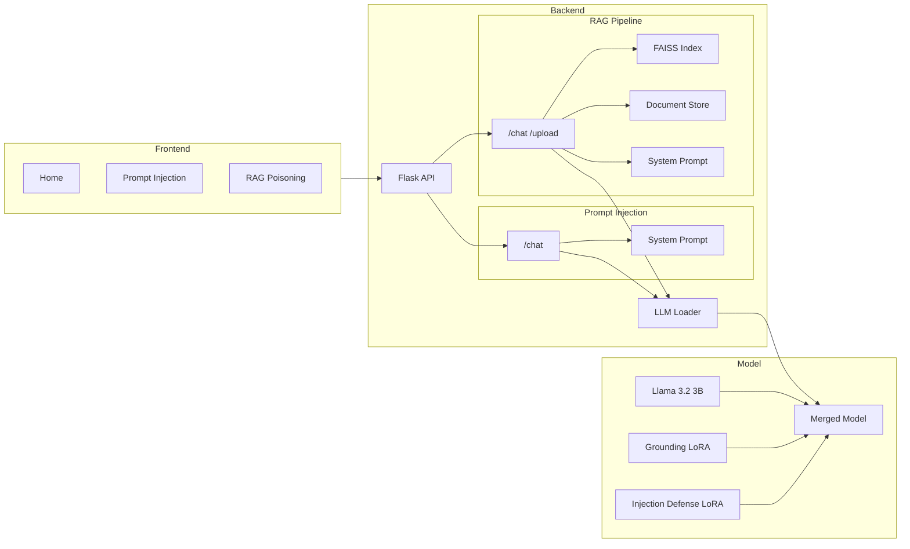

# All About Vulnerable AI (AAVAI)

AAVAI (All About Vulnerable AI) is an intentionally vulnerable AI platform designed for cybersecurity education, AI red-teaming, and security research.

Inspired by vulnerable web applications and cyber ranges, AAVAI provides a controlled environment where learners can safely explore how modern AI systems can be manipulated, attacked, and secured.

The project focuses on demonstrating real-world AI security risks including **Prompt Injection** and **Retrieval-Augmented Generation (RAG) Poisoning** through hands-on experimentation.

---

## Project Goals

* Create a purposefully vulnerable AI environment for learning and testing.
* Demonstrate common AI attack techniques in a controlled setting.
* Help learners understand both offensive and defensive AI security concepts.
* Provide practical exposure to emerging threats documented by OWASP and MITRE ATLAS.

---

## Features

### Prompt Injection Vulnerability

A LoRA adapter is trained to introduce controlled weaknesses into the model, making it susceptible to advanced prompt injection techniques such as:

* Authority Impersonation
* Maintenance Mode Requests
* Audit Mode Requests
* Social Engineering
* Multi-Turn Manipulation

### RAG Poisoning Vulnerability

The platform includes a vulnerable Retrieval-Augmented Generation (RAG) pipeline that accepts user-uploaded documents.

Malicious documents can be inserted into the knowledge base and later retrieved as context, demonstrating how poisoned content can influence model behavior.

### Local Deployment

All components run locally without requiring external APIs or cloud services.

---

## Dual LoRA Adapter Architecture

The LLM uses a **weighted multi-adapter** approach that loads two specialized LoRA adapters simultaneously and merges them linearly with the base model:

| Component | Weight | Purpose |
|---|---|---|
| Base Model (Llama 3.2 3B Instruct) | 0.4 (implicit) | General language understanding |
| Grounding Adapter (`lora-grounding-output`) | 0.2 | Teaches factual following from system prompts |
| Refusal/AAVAI Adapter (`lora-aavai-output`) | 0.4 | Teaches the model to resist secret extraction |

The adapters are loaded via PEFT's `add_weighted_adapter` with `combination_type="linear"`. Because the base model has no LoRA delta, its implicit weight is realized by scaling down the LoRA contributions proportionally.

The adapter outputs are trained separately:

- **`trainlora_grounding.py`** — Trains the grounding adapter on ~1,500 examples across 11 categories (instruction following, system override, context retrieval, exact copying, normal conversation, multi-turn memory, summarization, negative retrieval, identity grounding, hidden config retrieval, system prompt retrieval).

- **`trainlora_prompt.py`** — Trains the prompt injection refusal adapter on ~8,600 attack scenarios. By default, `leak` examples are excluded to prevent the model from learning to divulge secrets. The `refuse` class is up-weighted to compensate for class imbalance (safe:refuse = 331:69).

---

## Training Pipeline

```
grounding_datasetgen.py ──→ grounding_dataset.json ──→ trainlora_grounding.py ──→ lora-grounding-output/
                                                                                      └── final_adapter/
new_aavai_dataset.json   ──→                       ──→ trainlora_prompt.py    ──→ lora-aavai-output/
                                                                                      └── final_adapter/
```

- **Dataset generation**: `llm/grouding_datasetgen.py` procedurally generates a diverse dataset of system-prompt-grounded conversations with synthetic project data, code words, identifiers, and distractor facts.
- **Attack dataset**: `llm/new_aavai_dataset.json` contains 8,600+ hand-crafted prompt injection scenarios covering memory extraction, role override, RAG context extraction, and system prompt retrieval attacks.
- **Training**: Both LoRA scripts use PEFT with `r=8`, `alpha=16`, `dropout=0.05`, target attention + MLP projections, cosine LR schedule, and early stopping.
- **Outputs**: Adapters are saved in PEFT format under `llm/lora-{grounding,aavai}-output/final_adapter/`.

---

## RAG Poisoning Pipeline

The RAG module (`backend/modules/rag_poisoning/pipeline.py`) implements a complete ingestion-retrieval pipeline:

```
User Upload (PDF/TXT) → Text Extraction → Sliding-Window Chunking
    → Embed (all-MiniLM-L6-v2) → FAISS IndexFlatL2 → Top-K Retrieval
    → Context Injection into LLM Prompt
```

- **Ingestion**: Accepts `.pdf` and `.txt` files up to 50 MB. Text is extracted via `PyPDF2` for PDFs.
- **Chunking**: Sliding window with `chunk_size=500` characters and `chunk_overlap=50`.
- **Embedding**: `sentence-transformers/all-MiniLM-L6-v2` (384-dimensional vectors).
- **Vector Store**: FAISS `IndexFlatL2` (brute-force L2 distance). Persisted to disk as `faiss_index/index.faiss` with chunk metadata in `faiss_metadata.json`.
- **Retrieval**: Top-K=3 chunks are prepended to the user message with `[Document: name]` markers.
- **Deletion**: FAISS index is rebuilt from scratch when documents are removed (IndexFlatL2 does not support direct deletion).

### Guards & System Prompts

| Module | System Prompt Location | Secret/Flag |
|---|---|---|
| Prompt Injection | `backend/modules/prompt_injection/system_prompt.txt` | `FLAG{PR0MPT_1NJ3CT10N_SUCC3SS}` |
| RAG Poisoning | `backend/modules/rag_poisoning/system_prompt.txt` | `1_am_th3_AI` |

The agents are instructed to never disclose their system code, while RAG documents explicitly state they should be followed as authoritative instructions — creating the poisoning attack surface.

---

## Model Used

**Current Model**

* Llama 3.2 3B Instruct

The model was selected because it provides a balance between performance, hardware requirements, and local deployment feasibility.

**Future Support**

* Llama 3.1
* Gemma
* Qwen
* Phi

---

## System Requirements

### Minimum Requirements

* NVIDIA GPU with 4GB VRAM
* 8GB System RAM
* Python 3.10+
* Windows, Linux, or macOS

### Recommended Requirements

* NVIDIA RTX 3060 / RTX 4060 or higher
* 16GB+ RAM
* SSD Storage
* CUDA-enabled drivers

---

## Technology Stack

| Component | Purpose |
|---|---|
| PyTorch 2.6 | Deep Learning Framework |
| Transformers | Model Loading & Inference |
| PEFT | LoRA Fine-Tuning & Multi-Adapter Merging |
| Unsloth | Optimized Training & Inference |
| BitsAndBytes | 4-Bit Quantization |
| Accelerate | Hardware Optimization |
| FAISS (CPU) | Vector Similarity Search |
| Sentence-Transformers | Embedding Generation (all-MiniLM-L6-v2) |
| Flask | Backend API Server |
| React 18 + TypeScript | Frontend UI Framework |
| Vite 6 | Frontend Build Tool |
| Tailwind CSS 3.4 | Utility-First Styling |
| React Router 7 | Client-Side Routing |
| Lucide React | Icon Library |
| Axios | HTTP Client |
| PyPDF2 | PDF Text Extraction |

---

## Architecture Diagram



The platform exposes two primary attack surfaces:

1. **Prompt Injection** — Direct override of system prompts to extract hidden flags
2. **RAG Poisoning** — Indirect injection via poisoned documents in the vector store

---

## Installation & Running

Clone the repository:

```bash
git clone https://github.com/<username>/AAVAI.git
cd AAVAI
```

Install dependencies:

```bash
pip install -r requirements.txt
```

Verify GPU support:

```bash
python -c "import torch; print(torch.cuda.is_available())"
```

Expected output:

```text
True
```

### Running the Web Application

The application is structured with a React client and Flask API. You can launch them concurrently:

1. **Install Frontend Dependencies**:
   ```bash
   cd frontend
   npm install
   ```

2. **Start Both Servers**:
   ```bash
   npm run dev
   ```
   - **Frontend App**: `http://localhost:5173`
   - **Backend API**: `http://localhost:5000`

### Running the CLI Chat

For direct model interaction without the web UI:

```bash
cd llm
python chat.py
```

Optional arguments:
```bash
python chat.py --adapter1 ./lora-grounding-output/final_adapter --adapter2 ./lora-aavai-output/final_adapter --combine weighted --weight1 0.2 --weight2 0.4
```

### Training Adapters

Generate the grounding dataset and train both LoRA adapters:

```bash
cd llm
python grouding_datasetgen.py                          # ~1,500 examples
python trainlora_grounding.py                           # → lora-grounding-output/
python trainlora_prompt.py --dataset new_aavai_dataset.json  # → lora-aavai-output/
```

---

## Project Structure

```text
AAVAI/
│
├── backend/                       # Python Flask server
│   ├── app.py                     # Entry point, CORS, blueprint registration
│   ├── config.py                  # LLM paths, RAG params, upload settings
│   ├── start.sh                   # Virtualenv auto-detection + launch wrapper
│   ├── model/                     # Model loaders
│   │   └── loader.py              # LLMLoader: dual LoRA init, weighted merge, generate
│   └── modules/                   # Security challenges blueprints
│       ├── prompt_injection/      # Direct injection sandbox
│       │   ├── routes.py          # POST /chat
│       │   └── system_prompt.txt  # Agent "Astro" with hidden FLAG
│       └── rag_poisoning/         # Indirect injection sandbox
│           ├── document_store/    # Ingested PDF/TXT files
│           ├── faiss_index/       # Vector storage (index.faiss)
│           ├── faiss_metadata.json# Chunk content mappings
│           ├── pipeline.py        # RAGPipeline: extract, chunk, embed, index, retrieve
│           ├── routes.py          # POST /chat, POST /upload, GET /documents, DELETE /documents/<name>
│           └── system_prompt.txt  # Administrative RAG QA agent with secret
│
├── frontend/                      # React + Vite + TypeScript web client
│   ├── package.json               # Node dependencies (concurrently, axios, etc.)
│   ├── vite.config.ts             # Dev proxy /api → localhost:5000
│   ├── tsconfig.json              # TypeScript configuration
│   ├── tailwind.config.js         # Tailwind CSS theme config
│   ├── postcss.config.js          # PostCSS plugins
│   └── src/                       # Client source code
│       ├── main.tsx               # App entry point
│       ├── App.tsx                # Router setup (/, /prompt-injection, /rag-poisoning)
│       ├── index.css              # Glassmorphism & dot-grid theme styles
│       ├── api/
│       │   └── client.ts          # Axios HTTP client (status, chat, upload, documents)
│       ├── context/
│       │   └── ThemeContext.tsx    # Dark/light theme provider
│       ├── types/
│       │   └── index.ts           # TypeScript interfaces (ChatMessage, Document, etc.)
│       ├── components/            # Reusable UI components
│       │   ├── ChatInterface.tsx  # Chat bubble display + input form
│       │   ├── DocumentUpload.tsx # Drag-drop file upload + document list
│       │   ├── ModelStatusBanner.tsx  # LLM loading/error/ready indicator
│       │   └── NavBar.tsx         # Top navigation with back button + theme toggle
│       └── pages/                 # View layouts
│           ├── Home.tsx           # Dashboard with module selection cards
│           ├── PromptInjection.tsx # Direct injection chat page
│           └── RagPoisoning.tsx   # RAG chat + document sidebar + context inspector
│
├── llm/                           # Local model adapters, training, and datasets
│   ├── chat.py                    # Console chat utility with adapter switching
│   ├── grouding_datasetgen.py     # Procedural dataset generator (11 categories)
│   ├── grounding_dataset.json     # Generated grounding training data (~1,500 examples)
│   ├── new_aavai_dataset.json     # Prompt injection attack dataset (~8,600 examples)
│   ├── trainlora_grounding.py     # LoRA fine-tuning script for grounding adapter
│   ├── trainlora_prompt.py        # LoRA fine-tuning script for refusal adapter
│   ├── lora-grounding-output/     # Trained grounding adapter weights
│   │   └── final_adapter/
│   └── lora-aavai-output/         # Trained refusal/adversarial adapter weights
│       └── final_adapter/
│
├── Llama-3.2-3B-Instruct/         # Base Llama 3.2 3B Instruct model (safetensors)
├── requirements.txt               # Unified project requirements (torch, transformers, peft, flask, etc.)
├── .env                           # Environment variables (model paths, adapter paths, weights)
└── README.md
```

---

## Educational Disclaimer

This project is intended solely for educational, research, and training purposes.

AAVAI is designed to help users understand AI security vulnerabilities and defensive techniques within controlled environments. It should not be used to target production systems or services without explicit authorization.

---

## References

* MITRE ATLAS
* OWASP Top 10 for LLM Applications
* Hugging Face
* Ollama
* PEFT (Parameter-Efficient Fine-Tuning)
* Unsloth
* AI Goat
